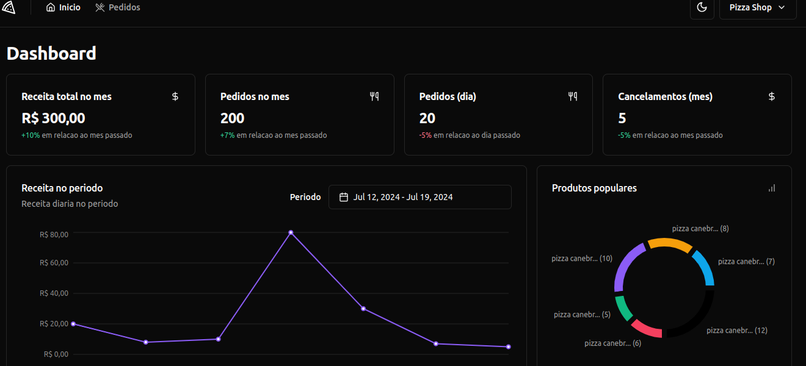
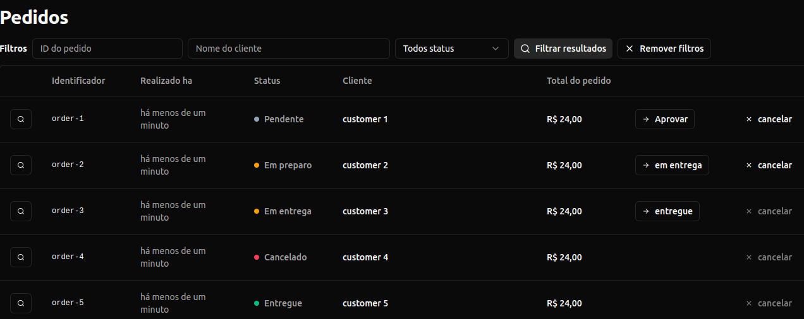

  

 

# Projeto

Este projecto foi desenvolvido no estudo de **Reactjs** do ignite.

## Tecnologias usadas

- [Vite](https://vitejs.dev)
- [ReactJS](https://reactjs.org)
- [TypeScript](https://www.typescriptlang.org/)

### Bibliotecas Front-End

- [Tailwindcss](https://tailwindcss.com/) css
- [Shadcn-UI](https://ui.shadcn.com/) componentes css
- [Recharts](https://recharts.org/en-US/) para graficos

### Testes

- [Vitest](https://vitest.dev/) testes unitarios de interface junto de [Happy-dom](https://github.com/capricorn86/happy-dom) para uma dom virtual
- [Msw](https://mswjs.io/) mock service worker para criar mocks de chamadas a API
- [Playwright](https://playwright.dev/) para teste End-to-End (E2E)

## Para rodar o projecto

Para este projecto usei o **nodejs 20.10.0**. para rodar o projecto na sua maquina use os seguintes passos.

1. Clone o projecto na sua maquina usando o seguinte link https://github.com/alfiadoDev/ignite-pizza-shop.git
2. Abra a sua linha de comandos, ou no **VS CODE** na linha de coomandos e execute o seguinte ``yarn`` ou ``npm install`` se estiver usando o gerenciador de pacotes **NPM**.
3. Crie na raiz do projecto o arquivo **.env.local** e copia o conteudo do arquivo **.env.example**. a variavel **VITE_ENABLE_API_DELAY** e' para dar um atraso nas requisicoes http, para efeitos de layout, ela so recebi true ou false.
4. para executar o projecto temos duas maneiras:
   - Para executar o projecto em tempo real, precisa de clonar o repositorio da Api na sua maquina, no link https://github.com/rocketseat-education/pizzashop-api. Depois de seguir as regras para instalar, execute o comando ``yarn dev`` no pizza-shop front-end.
   - Para executar o projecto em ambiente de testes unitarios execute o comando ``yarn dev:test``.
   - Para executar o projecto em ambiente de testes E2E execute o seguinte comando ``yarn playwright test --ui``.

## Layouts do projecto

### Pagina de Orders ``/orders``

  

